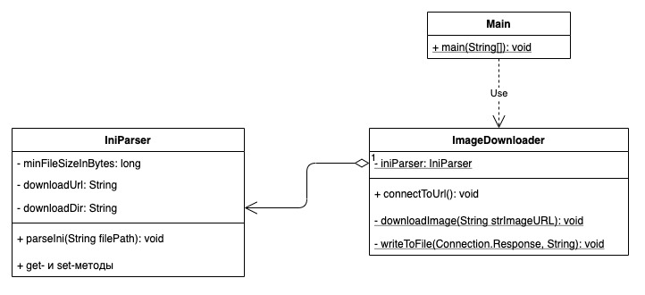
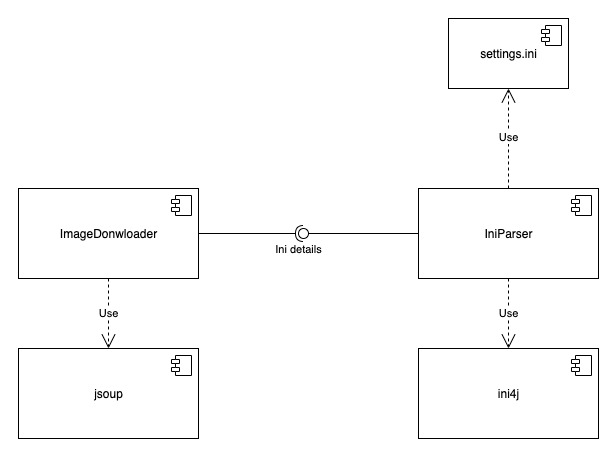
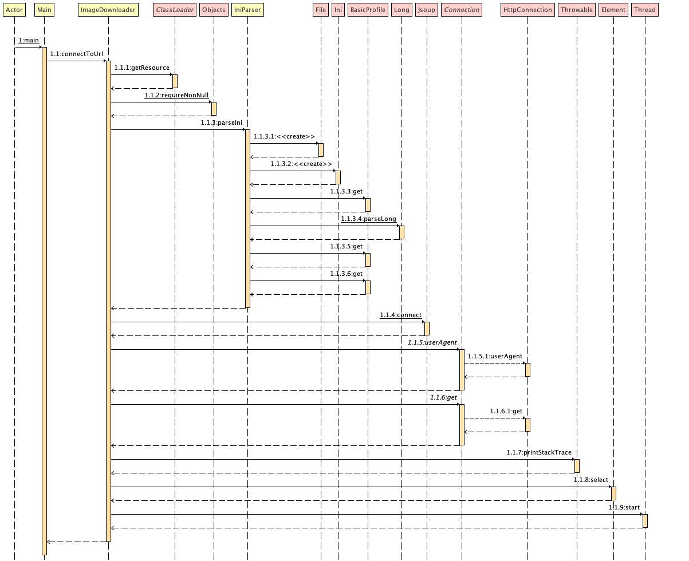
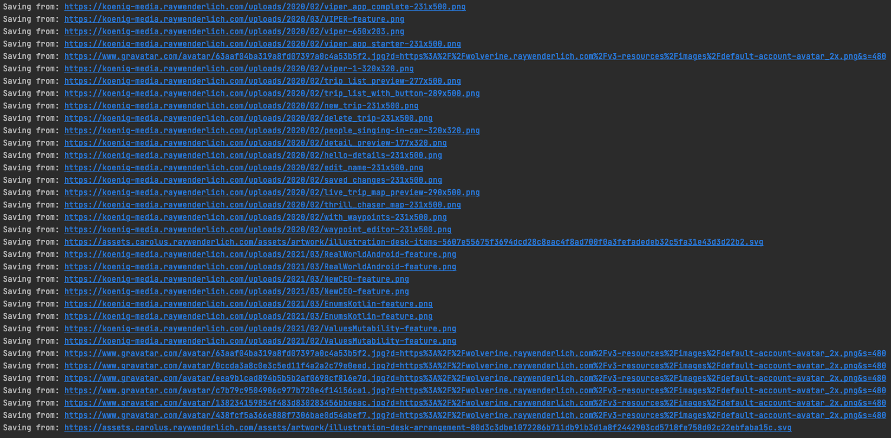
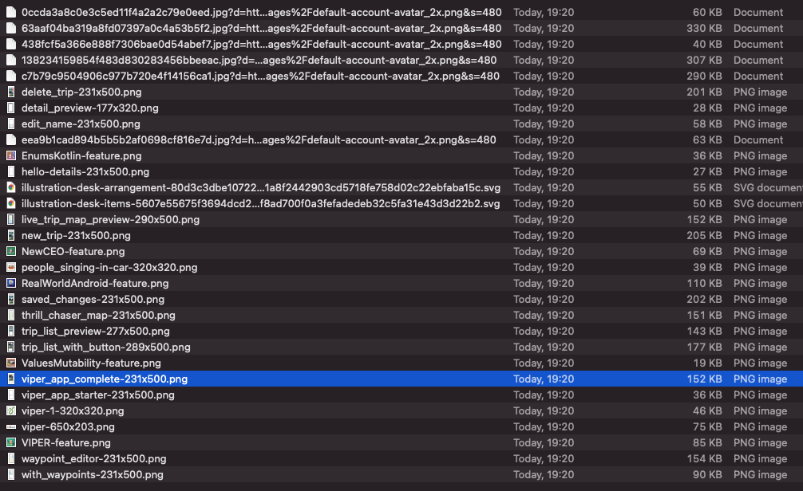

# Скачать все
## Постановка задачи
Скачивание картинок с сайта. На входе - URL страницы.
Необходимо скачать все изображения на странице, а также на всех дочерних страницах, на которые можно перейти по гиперссылкам. Скачивать изображения только > X КБ.
### Дополнительное задание
- [x] параметры приложения (URL, каталог для сохранения, размер X и др.) задавать в property-файле [+5 баллов]
- [x] использовать многопоточность для ускорения работы приложения, сравнить производительность [+25 баллов]
- [ ] выводить статистику раз в X ms в отдельном потоке во время работы приложения (какая картинка качается, сколько всего скачано) [+8 баллов]
## Описание архитектуры приложения
Для задания параметров приложения используется файл **settings.ini** со следующими полями:
1. minKb - минимальный размер изображения в Кб
2. downloadURL - URL, с которого скачиваем изображения
3. downloadDir - путь для сохранения изображений
   
Для обработки информации используется класс IniParser и библиотека **ini4j**.
У класса есть три поля, аналогичные полям файла **settings.ini**, и метод для парсинга файла,
принимающий в качестве параметра путь к файлу.

Для работы с HTML используется библиотека **jsoup** и класс imageDownloader.
У него есть один публичный метод, который выполняет подключение по указанному в IniParser'е URL.
Далее в массив imageElements сохраняются все элементы с тегом *img*
и в цикле в новом потоке вызывается приватный метод downloadImage(),
который проверяет, что изображение больше минимального указанного в Кб
и вызывает метод writeToFile(), сохраняющий массив байт в файл изображения.

Диаграмма классов: 

Диаграмма компонентов: 

Диаграмма последовательности: 

## Результаты работы приложения
Вывод в консоль: 

Директория с загруженными изображениями: 

## Вывод
Таким образом, было реализовано приложение для сохранения изображений,
размер которых больше заданного в Кб. Для задания параметров приложения
был реализован файл **settings.ini**. Использование многопоточности
сократило время выполнения приложения в среднем на *700 мс*.
Для работы с зависимостями использовался фреймворк **Apache Maven**
